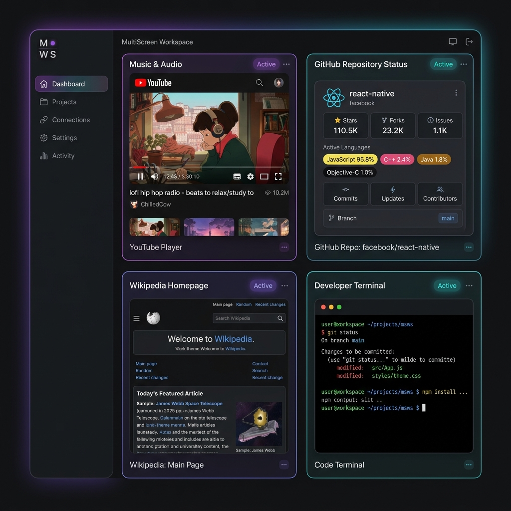

<div align="center">

# 🚀 MultiScreen

### 🌐 Advanced Responsive Multi-Screen Web Application


<br>


</div>

---

# 🌟 About The Project

**MultiScreen** is a modern responsive web application designed to manage and display dynamic multi-screen layouts with customizable grid systems and embedded media support.

The project focuses on creating a smooth user experience across multiple screen sizes while maintaining performance and responsive design principles.

This application demonstrates:

✨ Responsive Layout Design  
✨ Custom Grid Configuration  
✨ Dynamic Screen Scaling  
✨ Embedded Media Handling  
✨ YouTube URL Normalization  
✨ Modern UI Components  

---

# 🎨 Preview

<div align="center">


</div>

---

# ⚡ Features

<div align="center">

| 🚀 Feature | 💡 Description |
|------------|----------------|
| 📱 Responsive Design | Adapts perfectly across devices |
| 🧩 Custom Grid Layout | Flexible screen column configuration |
| 🎥 YouTube Embed Sync | Automatically normalizes standard watch and shorts URLs to inline playable embeds |
| 🐙 GitHub Live API Viewer | Renders beautiful stats, language badges, and commit histories directly in the grid |
| 🖥️ Multi-Screen Management | Optimized layout handling |
| ⚡ Glassmorphic Toasts | Dynamic notifications system for interactive clone options |
| 🎨 Modern UI | Clean, high-tech interface with custom theme states |

</div>

---

# 🛠️ Technologies Used

<div align="center">


</div>

---

# 📂 Project Structure

```bash
MultiScreen/
│
├── index.html       # Main HTML structure
├── style.css        # Application styling
├── app.js           # Core functionality
└── README.md
```

---

# 🚀 Getting Started

## 📥 Clone Repository

```bash
git clone https://github.com/Vijay11-08/MultiScreen.git
```

---

## 📂 Open Project

```bash
cd MultiScreen
```

---

## ▶️ Run Application

Simply open:

```bash
index.html
```

in your browser.

Or use VS Code Live Server for better development experience.

---

# 📸 Screenshots

<div align="center">

| MultiScreen Studio Workspace Dashboard |
|:--:|
|  |

</div>

---

# 🧠 Core Concepts Used

✅ Responsive Web Design  
✅ CSS Grid System  
✅ Dynamic Layout Handling  
✅ DOM Manipulation  
✅ Media Embedding  
✅ Frontend Optimization  

---

# 🔥 Future Improvements

- 🌙 Dark Mode
- 🔐 Authentication System
- ☁️ Cloud Storage Integration
- 🎞️ Smooth Animations
- 📊 Analytics Dashboard
- ⚙️ Advanced Layout Customization

---

# 👨‍💻 Developer

<div align="center">


<br><br>

# 🚀 Vijay Otaradi

### 💻 Full Stack Developer • 🌐 Frontend Creator • 📊 Data Science Enthusiast


<br>

<a href="https://github.com/Vijay11-08">

</a>

<a href="https://linkedin.com/in/vijay-otaradi-678427266">

</a>

<br><br>


<br>


</div>

---

# ⭐ Support

If you like this project:

🌟 Star the repository  
🍴 Fork the project  
📢 Share with developers  

---

# 📄 License

This project is licensed under the **MIT License**.

---

<div align="center">

### 🚀 "Build Responsive. Build Modern."


</div>
